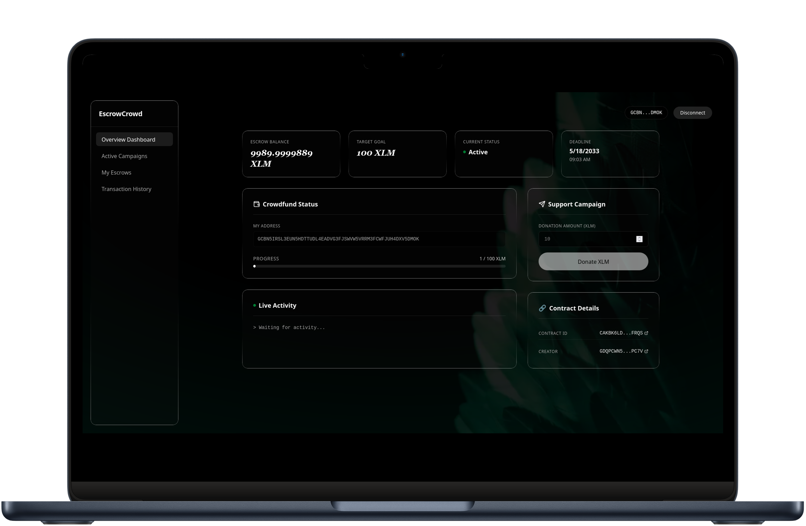
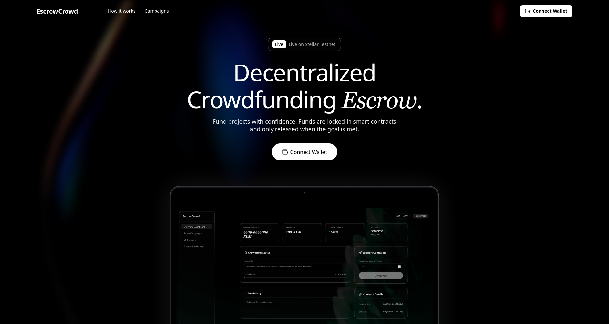
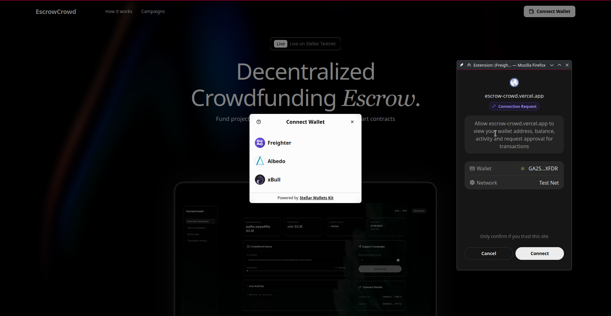
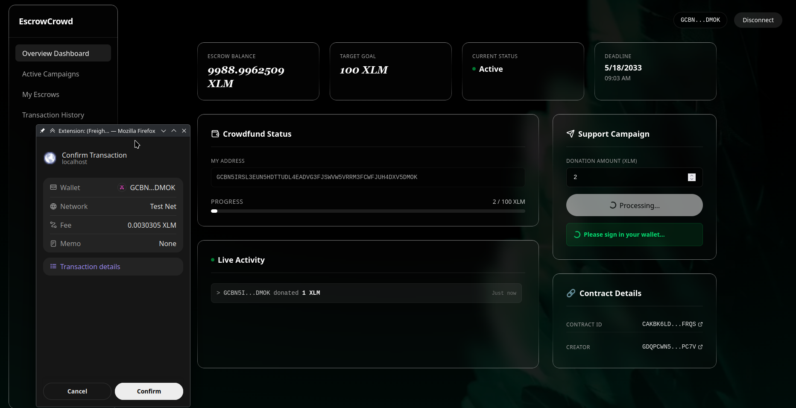

# EscrowCrowd: Decentralized Crowdfunding on Stellar

[](https://escrow-crowd.vercel.app)
[](https://stellar.org)
[](https://github.com/HarK-github/EscrowCrowd_App/actions/workflows/ci.yml)
[](https://github.com/HarK-github/EscrowCrowd_App)

EscrowCrowd is a trustless, decentralized crowdfunding platform built on the Stellar network using Soroban smart contracts. It guarantees that funds are only released to project creators if their funding goals are met. If a project fails to reach its goal by the deadline, backers can safely reclaim their XLM. 


 


## Architecture Overview
The application is purely decentralized and relies on two interlocking smart contracts communicating on-chain:
1. **CrowdfundContract:** The core escrow vault. It securely holds donated XLM, tracks the campaign goal/deadline, and handles refunds if the goal isn't met.
2. **RewardBadge Contract:** A separate NFT/badge contract. When a user donates above a certain threshold (e.g., 100 XLM), the `CrowdfundContract` directly invokes the `RewardBadge` contract to instantly mint a "Top Supporter" badge to the donor in a single, atomic transaction.

## Live Deployment
- **Frontend Vercel Deployment:** [https://escrow-crowd.vercel.app](https://escrow-crowd.vercel.app)
- **Deployed Crowdfund Contract:** `CANOYAM53C5Q6DNECYVNIQAQN5VI4GMWRXPGQ6CDTHNZBWPBAJ3A7AYA`
- **Deployed RewardBadge Contract:** `CAA3IZ7SVURXJP5YNZL66BKGKXOJWSP2KRVUJDRXIECGR3KHDGA4WISD`
- **Example Cross-Contract Transaction (Testnet Explorer):** [515e8f8f...](https://stellar.expert/explorer/testnet/tx/515e8f8f639c581bb97a67feae84a5dae0e5045935d45df19a01be6f5f8a1da5) (Shows a donation that triggered a cross-contract badge award)

## Application Screenshots

| Feature | Screenshot |
|---------|------------|
| **Dashboard Interface** |  |
| **Wallet Selection Options** |  |
| **Connecting Wallet** |  |
| **Transaction Signature Request** |  |
| **Transaction Successful** |  |

## Features
- **Smart Contract Escrow:** Absolute trust. Backers' XLM is locked securely by Soroban.
- **Real-Time Blockchain Sync:** Live activity feeds powered by Soroban RPC polling.
- **Automated Refund Protection:** Guaranteed refunds for unmet funding goals.
- **Stellar Speed:** Near-instant settlement on the Stellar Testnet.
- **Modern UI:** Glassmorphism, dynamic animations, and fully responsive bento grid layouts.

## Local Setup Instructions

1. **Clone the repository**
   ```bash
   git clone https://github.com/HarK-github/EscrowCrowd_App.git
   cd EscrowCrowd_App
   ```

2. **Install dependencies**
   ```bash
   npm install
   ```

3. **Configure Environment**
   Copy `.env.example` to `.env` and fill in your deployed `VITE_CONTRACT_ID`.
   ```bash
   cp .env.example .env
   ```

4. **Run the local development server**
   ```bash
   npm run dev
   ```
   Open `http://localhost:5173` in your browser.

5. **Prerequisites for Testing**
   - Install a Stellar-compatible wallet browser extension (e.g., [Freighter Wallet](https://www.freighter.app/)).
   - Switch the wallet to the **Stellar Testnet**.
   - Fund your wallet using the [Stellar Laboratory Friendbot](https://laboratory.stellar.org/#account-creator).

## Running Tests
This project includes full end-to-end and unit testing for both the smart contracts and the React frontend.

**To test the smart contracts (Rust):**
```bash
cd contracts
cargo test
```

**To test the frontend UI (Vitest):**
```bash
npm run test
```
