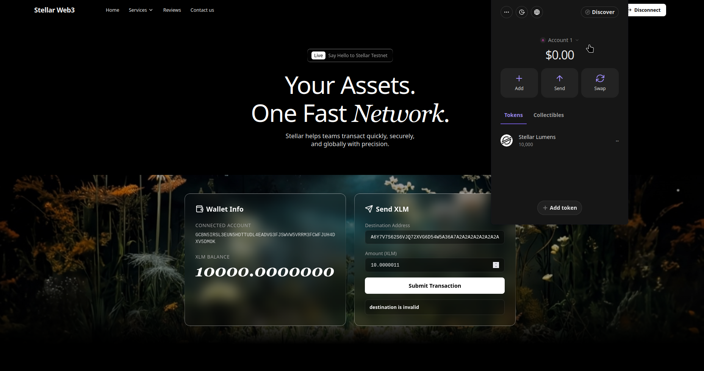
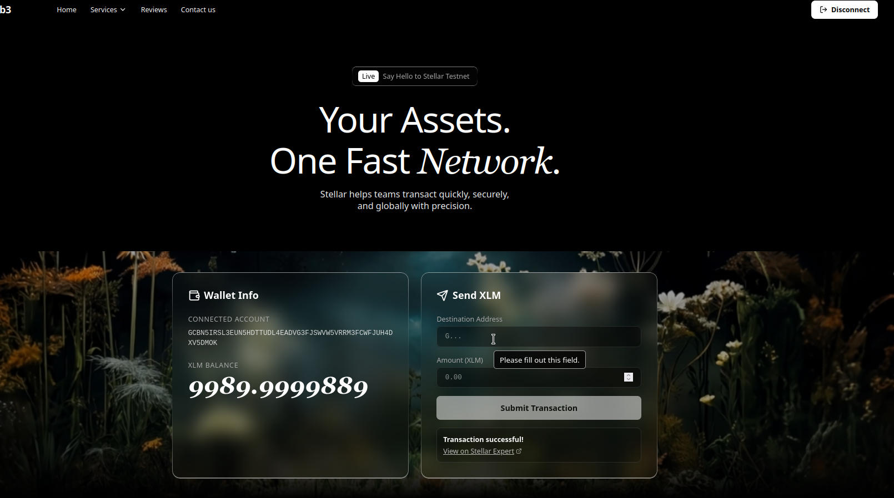
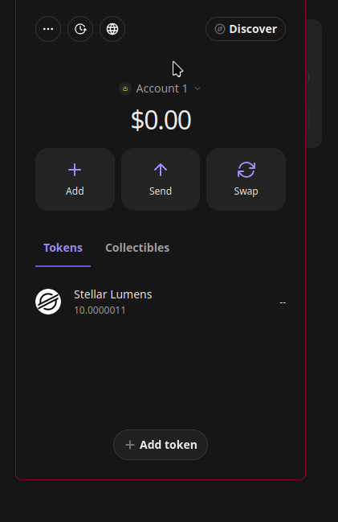

# 🚀 Stellar Web3 dApp (Level 1 - White Belt)

A premium, highly interactive decentralized application (dApp) built on the **Stellar Testnet**. This project serves as a showcase for seamless wallet integration and robust transaction capabilities on the Stellar network, wrapped in a beautiful, modern "liquid-glass" user interface.

## ✨ Features

- **Freighter Wallet Integration**: Connect and disconnect securely using the latest `@stellar/freighter-api`. Includes smart detection to prompt users if the extension is missing.
- **Testnet Exclusive**: Fully configured to interact exclusively with the Stellar Testnet, ensuring a safe sandbox environment.
- **Live Balance Fetching**: Instantly retrieves and elegantly displays the connected account's native XLM balance.
- **Smart Transaction Flow**: Sends native XLM transactions to any destination address. **Auto-detects** if the destination address is new/unfunded and intelligently switches from a `Payment` operation to a `CreateAccount` operation!
- **Real-Time Feedback**: Provides immediate transaction status (`loading`, `success`, `error`) and directly links the successful transaction hash to the Stellar Expert block explorer.
- **Premium Aesthetics**: Built with a sleek dark theme, glassmorphism (`liquid-glass`), and buttery-smooth staggered scroll animations via Framer Motion.

## 🛠 Tech Stack

- **Framework**: React 18 + Vite + TypeScript
- **Styling**: Tailwind CSS (v4) + Custom CSS Variables
- **Animations**: Framer Motion
- **Web3 SDKs**: `@stellar/freighter-api`, `@stellar/stellar-sdk`
- **Typography**: Inter & Instrument Serif

---

## 📸 Screenshots

| Wallet Connected State | Balance Displayed |
| :---: | :---: |
|  |  |

| Successful Testnet Transaction | Transaction Result |
| :---: | :---: |
|  |  |

---

## ⚙️ Setup Instructions

To run this project locally, follow these steps:

1. **Clone the repository**:
   ```bash
   git clone <your-repo-url>
   cd EscrowCrowd_App
   ```

2. **Install dependencies**:
   Ensure you have Node.js installed, then run:
   ```bash
   npm install
   ```

3. **Start the development server**:
   ```bash
   npm run dev
   ```

4. **Access the application**:
   Open your browser and navigate to the local URL provided in the terminal (usually `http://localhost:5173`).

5. **Prerequisites for Testing**:
   - Install the [Freighter extension](https://www.freighter.app/) in your browser.
   - Switch your Freighter network to **Testnet**.
   - Fund your account via the [Stellar Laboratory](https://laboratory.stellar.org/#account-creator?network=test).
