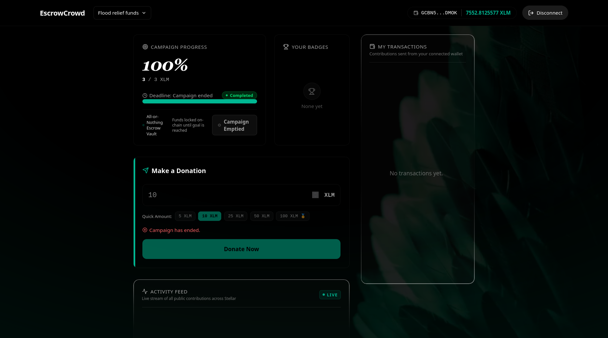
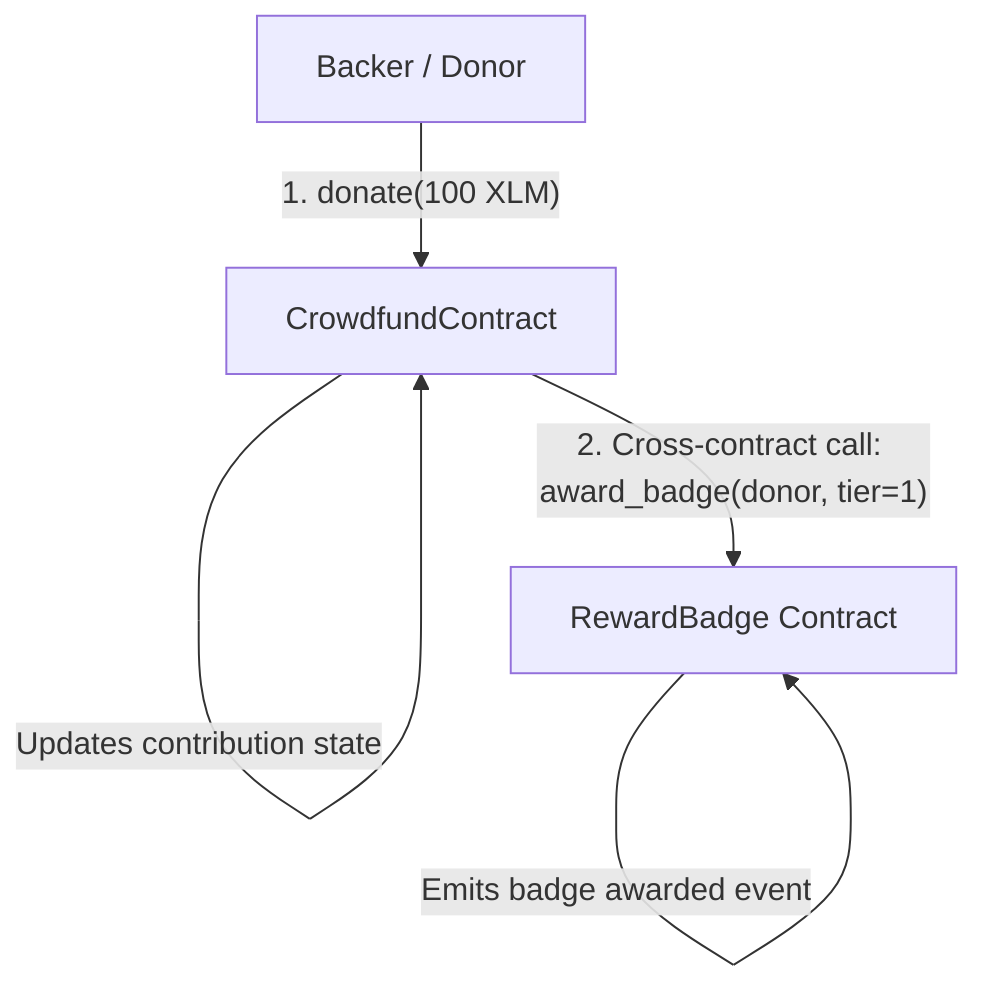
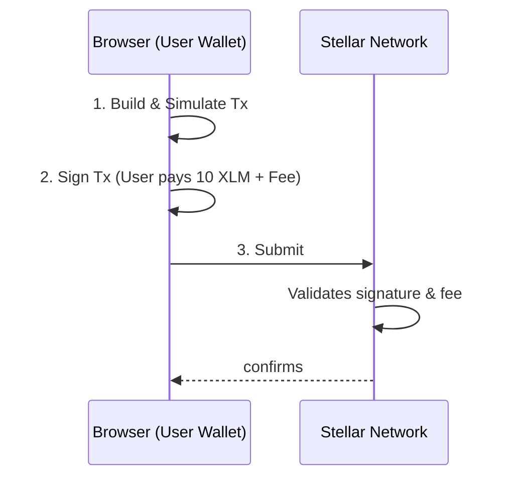
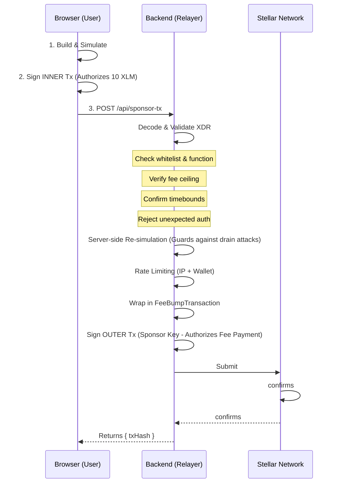

# EscrowCrowd: Decentralized Crowdfunding & Escrow on Stellar

[](https://escrow-crowd.vercel.app)
[](https://stellar.org)
[](https://github.com/HarK-github/EscrowCrowd_App/actions/workflows/ci.yml)
[](https://opensource.org/licenses/MIT)

**EscrowCrowd** is a decentralized, trustless crowdfunding and escrow platform built on the **Stellar network** using **Soroban smart contracts**. It guarantees that backer funds are held in transparent, automated escrow and only released to campaign creators when target funding goals are achieved before deadlines. If a campaign fails to reach its goal, backers are guaranteed refunds without intermediaries.

---

## Demo video: https://drive.google.com/file/d/1mgehQliBfAuGfMMY_2ceGnMjw4RyBaim/view?usp=sharing

## 🌟 Application Preview
  

| Dashboard | Wallet Selection | Connecting Wallet | Transaction Popup | Transaction Complete |
|---|---|---|---|---|
|  |  |  |  |  |

---

## ✨ Key Features

- **Smart Contract Escrow:** Absolute trust. Backers' XLM is locked securely by Soroban until funding goals and deadlines are validated on-chain.
- **Inter-Contract Reputation Badges:** Autonomous on-chain invocation awarding "Top Supporter" badges for contributions $\ge 100\text{ XLM}$.
- **Hybrid Real-Time Architecture:** A dedicated Node.js/Socket.IO backend continuously indexes blockchain events, streaming live donation feeds and progress bar updates instantly to the UI.
- **Graceful Decentralized Fallback:** If the backend socket disconnects, the frontend seamlessly degrades to direct on-chain Soroban RPC polling, ensuring 100% uptime without a centralized single point of failure.
- **Automated Refund Protection:** Guaranteed refunds for unmet funding goals.
- **Stellar Speed:** Near-instant settlement and low transaction fees on Stellar Testnet.
- **Modern Responsive UI:** Glassmorphism, dynamic animations, mobile-first responsive stacking, and accessible touch targets down to 320px.

---

## 🏛️ Smart Contract Architecture & Inter-Contract Communication

The system is built on two distinct, interlocking Soroban smart contracts operating on the Stellar Testnet:

1. **CrowdfundContract (`CANOYAM53...7AYA`)**: The core escrow vault. It securely locks contributed XLM, tracks deadline timestamps and goal thresholds, manages donor contribution ledgers, and enables creator withdrawals or automated refunds.
2. **RewardBadge Contract (`CAA3IZ7SV...WISD`)**: An auxiliary on-chain badge/reputation contract. When a backer contributes $\ge 100\text{ XLM}$, the `CrowdfundContract` directly performs an **inter-contract invocation** to `award_badge()` in the donor's account.



### ⚖️ Critical Design Decision: Cross-Contract Error Handling
> **Tradeoff Rationale:** In `CrowdfundContract::donate()`, the cross-contract call to `RewardBadge` is wrapped using `env.try_invoke_contract()`. If the badge contract runs out of gas, is upgraded, or fails, the core donation **does not roll back**.
>
> *Financial integrity is prioritized over ancillary gamification:* a donor's financial pledge must succeed reliably even if non-critical reward metadata encounters transient issues.

---

## 🔗 Relationship to Freelancer Escrow Network

This crowdfunding dApp serves as a concrete, production-ready implementation of the core **trust-and-transparency escrow pattern** designed for our larger **Freelancer Escrow Network** architecture. By enforcing decentralized escrow custody, multi-wallet authentication, and cross-contract event verification within Soroban, EscrowCrowd demonstrates the foundational building blocks required for milestone-gated freelance payments and decentralized reputation tracking on Stellar.

---

## 🔍 On-Chain Contract Transparency Panel

EscrowCrowd includes an integrated **Contract Transparency Panel** directly in the UI (available on both the Landing page and Dashboard):

- **Live Ledger Sequence Pulse:** Real-time synchronization displaying the latest Stellar Testnet ledger sequence via Soroban RPC.
- **Direct Explorer Links:** One-click navigation to verified contract addresses on [Stellar Expert Explorer](https://stellar.expert).
- **Verified Transaction Proofs:** Live links to the deployment transaction and on-chain cross-contract execution proofs.
- **One-Click Address Copy:** Instant clipboard copy with visual confirmation feedback.

### Verified Testnet Deployments & Proofs

| Contract / Action | Address / Transaction Hash | Explorer Link |
|---|---|---|
| **Crowdfund Escrow Contract** | `CANOYAM53C5Q6DNECYVNIQAQN5VI4GMWRXPGQ6CDTHNZBWPBAJ3A7AYA` | [View on Stellar Expert](https://stellar.expert/explorer/testnet/contract/CANOYAM53C5Q6DNECYVNIQAQN5VI4GMWRXPGQ6CDTHNZBWPBAJ3A7AYA) |
| **RewardBadge Contract** | `CAA3IZ7SVURXJP5YNZL66BKGKXOJWSP2KRVUJDRXIECGR3KHDGA4WISD` | [View on Stellar Expert](https://stellar.expert/explorer/testnet/contract/CAA3IZ7SVURXJP5YNZL66BKGKXOJWSP2KRVUJDRXIECGR3KHDGA4WISD) |
| **Deployment Transaction** | `93e4b3b2fc78ef5bfd1bf4cd31364c0f1c1cf63cb3164767c9c547780957168a` | [View Deployment Tx](https://stellar.expert/explorer/testnet/tx/93e4b3b2fc78ef5bfd1bf4cd31364c0f1c1cf63cb3164767c9c547780957168a) |
| **Cross-Contract Proof Tx** | `515e8f8f639c581bb97a67feae84a5dae0e5045935d45df19a01be6f5f8a1da5` | [View Cross-Contract Tx](https://stellar.expert/explorer/testnet/tx/515e8f8f639c581bb97a67feae84a5dae0e5045935d45df19a01be6f5f8a1da5) |

---

### 1. Centralized Contract Factory (Implemented)
To solve the issue of contract upgradability and fragmentation, EscrowCrowd now uses a **Factory Contract Pattern**. Instead of users individually deploying contracts, the Factory maintains the latest, most secure WASM hash and deploys instances natively on-chain.
- **Global Discovery:** The Factory maintains a registry of all deployed campaigns and their metadata, allowing the frontend to dynamically list every active campaign.
- **RewardBadge Hardening:** The `RewardBadge` contract now enforces a caller allowlist. Only campaigns legitimately deployed and registered by the Factory are authorized to mint badges, elegantly closing a major security gap.

### 2. Hybrid Real-Time Event Indexing (Implemented)
Initially, the frontend queried the Stellar RPC directly to discover campaigns and poll for donation events. However, polling scales poorly with thousands of users.

To solve this, EscrowCrowd implements a **hybrid architecture**:
- **Centralized Speed (Node.js Backend):** A lightweight `backend/server.js` acts as an indexer, constantly tailing the Stellar ledger for contract events. When a donation occurs, it instantly pushes a `new_donation` event via **Socket.IO** to connected clients, resulting in snappy, zero-latency UI updates for the Activity Feed and Campaign Progress bars.
- **Decentralized Reliability (RPC Fallback):** The React frontend is built with graceful degradation. If the backend server goes down, the frontend automatically switches back to decentralized RPC polling. The UI never goes stale, prioritizing decentralization and reliability while optimizing for UX.

---

## ⚡ Gasless Donations (Fee-Bump Relayer)

To remove friction for new users who may not have enough XLM to cover transaction fees and the minimum account reserve, EscrowCrowd implements a **Gasless Donation Flow** utilizing Stellar's native `FeeBumpTransaction`.

This architecture allows the platform to sponsor transaction fees while maintaining a completely **trustless, non-custodial** guarantee for user funds.

### 1. Normal Donation Flow

In a standard transaction, the user pays both the donation amount and the network fee from their own wallet:



### 2. Gasless Donation Flow (Fee Sponsorship)

In the gasless flow, the user still signs the core transaction (proving they authorized the transfer of their 10 XLM), but the backend wraps it in a fee-bump envelope signed by the platform's sponsor account. The platform pays the fee, but the backend never holds the user's funds.



### Security & Limits
- **Server-Side Re-Simulation:** The backend re-simulates the user's signed XDR before signing the fee-bump to ensure the transaction will succeed, preventing attackers from draining the sponsor's balance with failing transactions.
- **Strict Validation:** The backend enforces an 8-point validation checklist (e.g., exactly one operation, must be `invokeHostFunction`, contract must be in `WHITELISTED_CONTRACTS`, function must be `donate`).
- **Sliding-Window Rate Limiting:** Enforced per IP address and per wallet address to prevent spam.

---

## 🛡️ Production Hardening & Reliability Features

1. **Transaction State Machine & In-Flight Click Guard:**
   - Centralized state machine (`idle` → `preparing` → `signing` → `confirming` → `success` / `error`).
   - `isSubmitting` click-guard with guaranteed `finally` release block to prevent accidental double-signing while ensuring buttons never remain locked after a rejection.
2. **Cursor-Based Event Pagination & Scoped Backoff:**
   - Event queries track `lastCheckedLedger + 1` to eliminate duplicate event fetching.
   - Background polling applies exponential backoff on network failures ($5\text{s} \to 10\text{s} \to 20\text{s} \to 30\text{s}$ ceiling) and resets immediately on recovery.
   - Financial transactions (`donate()`) are **never silently retried**.
3. **Comprehensive Client-Side Validation:**
   - Rejects non-numeric, zero, or negative inputs with inline feedback.
   - Real-time wallet balance validation disabling submission before any transaction is built.
4. **Mobile Responsive Layout:**
   - Stacking order optimized for mobile: Donate Form placed at the top (`order-first md:order-none`), 48px touch targets, mobile wallet pill, and responsive toasts down to 320px viewport width.

---

## ⚠️ Handled Error Scenarios

1. **Wallet Not Installed:** Detects missing extensions (Freighter, Albedo, xBull) and renders an actionable installation banner.
2. **Connection Rejected:** Catches user dismissal gracefully without crashing state and displays a non-blocking toast.
3. **Insufficient Balance:** Compares donation input against active account balance in real-time, blocking submission with a clear explanation.

---

## ⚙️ Continuous Integration (CI/CD)

The repository includes a comprehensive GitHub Actions workflow (`.github/workflows/ci.yml`) validating every commit:
- **Rust Toolchain:** Pinned to `1.81.0` with `wasm32-unknown-unknown` target.
- **Contract Compilation & Tests:** `cargo build --target wasm32-unknown-unknown --release` and `cargo test` (5 smart contract unit tests).
- **Frontend Quality Assurance:** `oxlint` linting, Vitest unit test suite (6 frontend tests), and Vite production bundle compilation.

---

## 🚀 Local Development Setup

### 1. Prerequisites
- [Node.js](https://nodejs.org/) (v18 or v20)
- [Rust](https://rustup.rs/) (v1.81.0 recommended) with `wasm32-unknown-unknown` target:
  ```bash
  rustup target add wasm32-unknown-unknown
  ```
- A Stellar wallet extension (e.g. [Freighter](https://www.freighter.app/)) set to **Stellar Testnet**.
- Testnet XLM funded via [Stellar Friendbot](https://laboratory.stellar.org/#account-creator).

### 2. Installation
```bash
git clone https://github.com/HarK-github/EscrowCrowd_App.git
cd EscrowCrowd_App
npm install
```

### 3. Environment Configuration
Copy the example environment file:
```bash
cp .env.example .env
```
Ensure `.env` contains the required testnet configurations:
```ini
VITE_CROWDFUND_CONTRACT_ID=CANOYAM53C5Q6DNECYVNIQAQN5VI4GMWRXPGQ6CDTHNZBWPBAJ3A7AYA
VITE_REWARD_BADGE_CONTRACT_ID=CAA3IZ7SVURXJP5YNZL66BKGKXOJWSP2KRVUJDRXIECGR3KHDGA4WISD
VITE_HORIZON_URL=https://horizon-testnet.stellar.org
VITE_SOROBAN_RPC_URL=https://soroban-testnet.stellar.org
VITE_STELLAR_NETWORK_PASSPHRASE="Test SDF Network ; September 2015"
```

### 4. Run Development Server
```bash
npm run dev
```
Navigate to `http://localhost:5173`.

---

## 🧪 Running Tests

### Smart Contract Unit Tests (Rust)
```bash
cd contracts
cargo test
```

### Frontend Unit & Component Tests (Vitest)
```bash
npm run test
```

### Linting & Production Build
```bash
npm run lint
npm run build
```

---

## 📄 License
This project is licensed under the [MIT License](LICENSE).